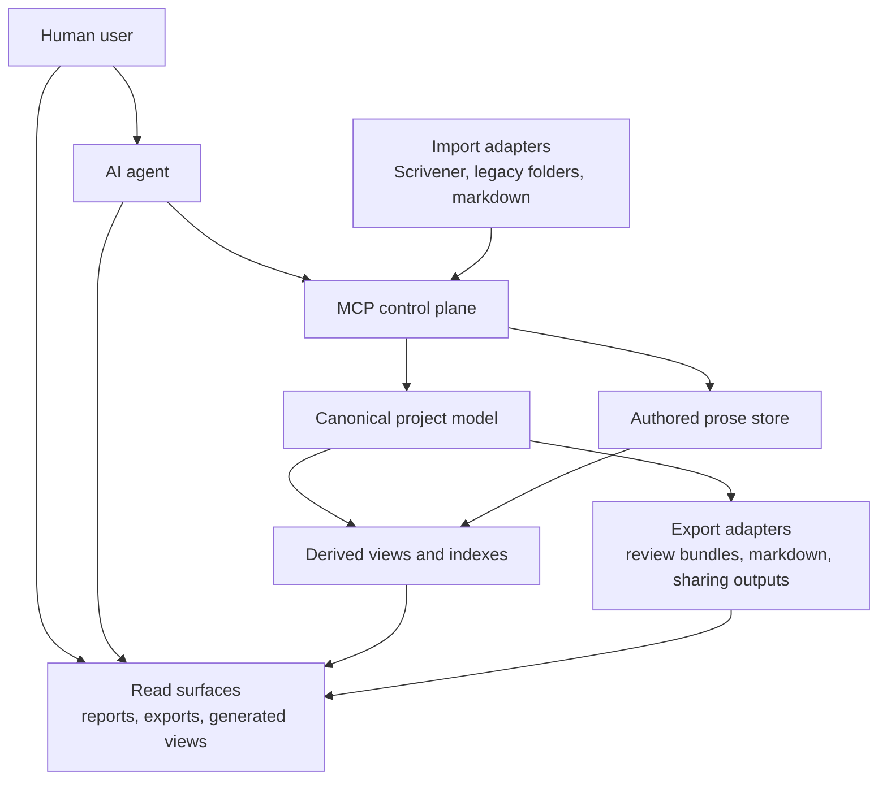

# Conceptual Target Architecture

**Status:** Design reference

This document captures the conceptual target architecture for Writing MCP based on the current design discussion.
It is intentionally idealized.
Use it to evaluate future initiatives, migration choices, and tooling boundaries without overfitting to the current filesystem layout or implementation constraints.

## Core Idea

The manuscript is a structured domain model with prose attachments, not a folder tree with metadata sprinkled around it.

The filesystem still matters, but primarily as:
- storage
- audit trail
- portability layer
- generated transparency surface

It should not be the primary control plane for structural manuscript state.

## High-Level Shape

## Architectural Layers

### 1. MCP Control Plane

All structural mutations should go through sanctioned MCP workflows.

This includes:
- chapter creation and rename
- chapter order changes
- scene-to-chapter assignment
- epigraph attachment
- division membership
- metadata relationship changes
- future structural entities

This rule applies equally to human users and AI agents.
The AI should not become a privileged second manual editor just because it is capable of touching raw files directly.

### 2. Canonical Project Model

The canonical project model is the real source of truth for structural state.

It owns:
- durable IDs
- ordering
- relationships
- canonical metadata
- structural invariants

Representative entity classes include:
- project
- division
- chapter
- scene
- epigraph
- character
- place
- thread
- style and configuration artifacts

The key separation is:
- identity is not title
- order is not folder name
- membership is not physical containment
- readable representation is not authority

### 3. Prose Store

Prose is different from structure.

It should remain:
- human-meaningful
- inspectable
- editable in supported workflows

But prose should be attached to stable structural IDs rather than acting as the structure model itself.
That allows prose to stay plain-text and author-facing while structure remains validated and command-driven.

### 4. Derived Views

Derived views are generated transparency surfaces, not sources of truth.

Examples:
- chapter overview
- outline and index views
- diagnostics reports
- search indexes
- review bundles
- generated agent-facing tool docs
- release-oriented summaries

They exist to make the project understandable and reviewable without promoting the visible representation into the domain model.

Rule:
- generated transparency is good
- generated authority is not

### 5. Import Adapters

Import is a special mode.

Import may cautiously infer structure from:
- Scrivener sync output
- legacy folder layouts
- historical naming
- metadata sidecars
- existing prose

But import should:
- explain ambiguity
- surface warnings
- draft canonical state before blessing it
- stop being authoritative once canonical state is established

Import is a bridge from messy reality, not a permanent mutation model.

### 6. Export Adapters

Exports are projections for humans or external tools.

Examples:
- review bundle outputs
- shareable manuscript exports
- Scrivener-compatible outputs
- generated summaries and reports

Exports should read canonical state and prose, but they should not redefine either one.

## Artifact Classes

| Artifact class | Examples | Mutation rule |
| --- | --- | --- |
| Authored prose | Scene text, epigraph text | Editable in supported prose workflows |
| Canonical structure | IDs, order, membership, links | MCP-only mutation |
| Derived views | Reports, indexes, bundles, generated docs | Regenerated from canonical state |
| Migration inputs | Scrivener output, legacy folders, old numbering | Interpreted during import only |

## Workflow Zones

### Setup and Import

Setup and import are intentionally more permissive about interpretation.
Their job is to create canonical state from a less controlled source.

Allowed:
- infer cautiously from source structure and legacy material
- surface warnings and ambiguity
- generate stable canonical identities
- present a reviewable import result before commitment

### Working on the Project

Daily project work should be strict about structural mutation paths.
The human expresses intent, the AI resolves targets when needed, and the MCP validates and writes canonical state.

Allowed:
- read canonical state, prose, and generated views
- edit prose through supported prose workflows
- mutate structure through named operations
- generate diagnostics, bundles, and other read surfaces

### Ongoing Maintenance

Maintenance may inspect broadly, but canonical repair should remain deliberate.

Allowed:
- lint structure and metadata
- detect stale or inconsistent derived state
- regenerate indexes and generated views
- propose or run explicit repair workflows

Maintenance should not quietly fix canonical structure as a side effect of inspection.

## Filesystem Role

In the target architecture, the filesystem is a representation layer, not the primary structure UI.

That means folder names should not be overloaded to carry:
- durable identity
- canonical title
- canonical order
- full structure semantics

This is why opaque or semi-opaque storage becomes attractive over time.
Opacity can be a feature when it signals that the area is managed system state rather than a casual editing surface.

The lost readability should be replaced by:
- MCP read tools
- generated views
- exports
- diagnostics

## AI Boundary

The architecture must explicitly account for the AI as an actor.

That means:
- AI may read broadly
- AI should use MCP workflows for structural writes
- AI may edit prose where the workflow supports it
- AI should not patch structural files directly when a sanctioned workflow exists
- if no sanctioned workflow exists, the AI should expose the product gap rather than improvising

Without this boundary, the system risks protecting itself from human direct editing while leaving the AI as an unsafe shortcut around the entire design.

## Governing Rules

1. The manuscript is a domain model, not a folder tree.
2. Structure changes go through one trusted mutation path.
3. Prose and structure have different editing rules.
4. Filesystem representations are valuable, but not authoritative.
5. Generated views explain state; they do not define it.
6. Import may infer; daily work should be explicit.
7. Maintenance may diagnose broadly; repair should be deliberate.
8. Humans and AI follow the same structural guardrails.

## What This Architecture Buys Us

This architecture is intended to prevent a visible representation from hardening into the wrong schema.

In practical terms, it supports:
- title changes without identity drift
- order changes without misleading path semantics
- future divisions without repeating the same coupling mistake one level higher
- generated transparency without split authority
- AI assistance without AI bypassing structural invariants
- long-term scaling as manuscript structure becomes richer

## Related

- [Product Overview](../../PRODUCT.md)
- [Managed Structure Contract](./managed-structure-contract.md)
- [Data Ownership](./data-ownership.md)
- [Chapter Structure Follow-up](../initiatives/backlog/chapter-structure/prd.md)
