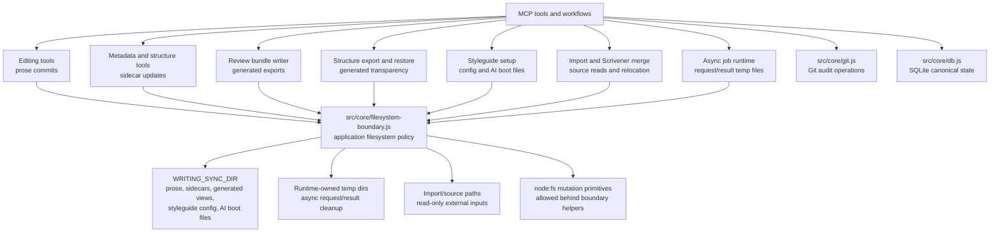

# Filesystem Boundary Architecture

This document captures the technical shape for the Filesystem Boundary Hardening initiative.
Use [prd.md](prd.md) for product framing and [milestones.md](milestones.md) for implementation sequencing.

## Proposed Architecture

Extract and extend the existing filesystem guard patterns into a small filesystem boundary module under `src/core/`.
The current `src/core/helpers.js` sync-root containment helpers should be treated as extraction material rather than duplicated with a parallel implementation.

Candidate responsibilities:

- resolve a candidate path against `WRITING_SYNC_DIR`;
- resolve paths that may not exist yet by canonicalizing the nearest existing ancestor;
- resolve and validate runtime-owned temporary paths created by the async job manager;
- distinguish import/source paths that may be read outside the sync root from mutation targets that must remain inside an approved boundary;
- expose artifact-class-aware helpers or options so callers do not treat prose, sidecars, generated exports, styleguide config, and AI boot files as interchangeable path writes;
- validate output directories and generated filenames;
- assert regular files and reject or explicitly handle symlinks;
- provide guarded directory creation, write, copy, delete, and move operations;
- define how multi-step writes handle partial failure, rollback, and cleanup;
- reduce avoidable race windows for destructive or overwrite operations where practical, without trying to create an adversarial local-process sandbox;
- return consistent validation errors and diagnostic details.

Git and SQLite mutate files indirectly through their own engines.
They are excluded from this shared filesystem boundary module, but should remain governed by focused modules such as `src/core/git.js` and `src/core/db.js`.
If the filesystem boundary module starts accumulating broad artifact-specific branching, split helpers by artifact class instead of creating one large catch-all abstraction.

## Architecture Overview

This initiative should make filesystem mutation flow through one recognizable boundary layer while leaving workflow intent visible in feature modules.
The graph is an orientation map for future implementation and review sessions, not a complete dependency diagram.



Git and SQLite are shown as side lanes because this initiative does not try to wrap their internal file mutations.
The boundary module should instead keep direct application filesystem operations explicit, searchable, and artifact-aware.

## Candidate Helper Shape

```js
resolveInsideSyncDir(candidatePath)
resolveCandidateInsideSyncDir(candidatePath)
resolveOutputDirWithinSync(outputDir)
resolveGeneratedOutputPath(outputDir, fileName)
resolveRuntimeTempPath(tempDir, candidatePath)
assertImportSourcePath(path)
assertRegularFile(path)
ensureDirectoryInsideBoundary(path)
writeTextInsideSync(path, content)
copyInsideBoundary(fromPath, toPath)
deleteInsideSync(path)
moveInsideSync(fromPath, toPath)
```

The exact names can change.
The important contract is that callers use helpers that encode the filesystem boundary being trusted.

## Filesystem Policy Questions

Implementation should answer these explicitly before broad migration:

- Which operations follow symlinks, and which reject them?
- Should generated output writes overwrite existing files, fail, or require an explicit option?
- Which artifact classes need distinct helper entry points or explicit options?
- Which operations merely validate before mutation, and which should reduce avoidable race windows with exclusive create, temp-file rename, or immediate revalidation?
- Should writes be atomic where practical, and how should multi-file workflows handle partial writes or rollback after failure?
- When a move crosses filesystem devices, is copy-and-delete fallback allowed, and how are partial copy/delete failures reported or cleaned up?
- Which paths may exist outside `WRITING_SYNC_DIR` during import or setup, and are they read-only?
- Which runtime temporary paths are owned by the application, and how are request/result cleanup operations constrained to those paths?
- Should indexed `scene.file_path` values be revalidated before every write, or only when stale/path diagnostics are present?
- How should helpers preserve existing `WRITING_SYNC_DIR` read-only and permission guidance instead of surfacing generic filesystem errors?
- How should helper errors map to existing MCP error envelopes?
- Which low-level modules are allowed to perform raw filesystem mutation after the migration?

## Related

- [prd.md](prd.md)
- [milestones.md](milestones.md)
- [Managed Structure Contract](../../../foundations/managed-structure-contract.md)
